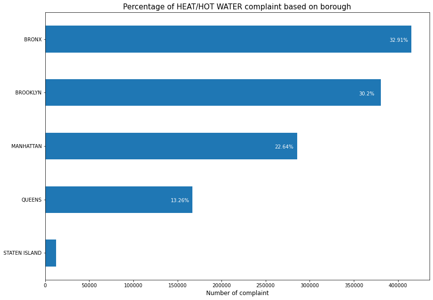
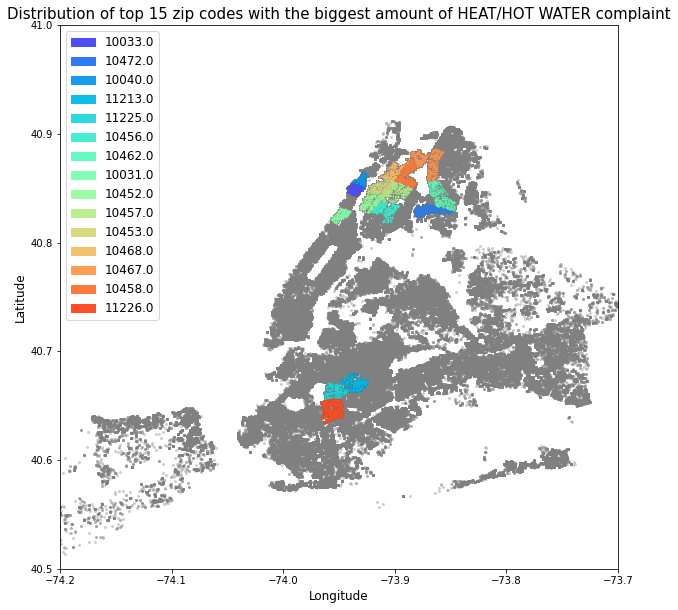
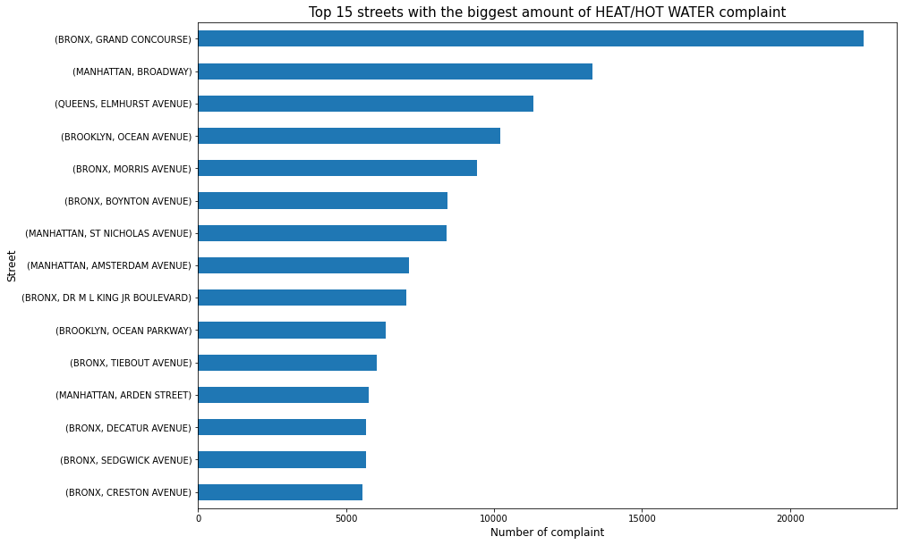

# Data Science - New York Housing Complaint Project

This project aims to analyze housing complaints data from the New York City Department of Housing Preservation and Development (HPD) to provide valuable insights for data-driven decision making and problem-solving related to New York City's housing.

## Key Features

1. Complaint Type Prioritization: Identify the most common complaint type to determine priority for resolution.
2. Geographic Analysis: Explore boroughs, ZIP codes, and streets to pinpoint areas with severe housing complaints.
3. Relationship Between Complaint Types and Housing Characteristics: Investigate how housing features relate to different complaint types.

Dataset: [311 NYC Dataset](https://cf-courses-data.s3.us.cloud-object-storage.appdomain.cloud/IBMDeveloperSkillsNetwork-DS0720EN-SkillsNetwork/labs/Module%201/data/311_Service_Requests_from_2010_to_Present_min.csv)

## Results

The analysis reveals that the "Heat/Hot Water" complaint type has the highest number of occurrences. Consequently, it is recommended that the HPD prioritize resolving this complaint type to address the most common issue faced by residents.

   

To provide actionable insights, the analysis offers three approaches for the HPD to consider when addressing complaints based on geographical regions: boroughs, ZIP codes, and streets. The following visualizations highlight the areas with the highest complaint volumes:

By calculating the mean values of house features per complaint type and performing ANOVA, we identify the top 5 and last 5 features based on their F-test values. These features indicate potential relationships with different complaint types, as shown in the following table:

| House Feature  | F-test     | p-value      |
| ---------------| ---------- | ------------ |
| NumFloors      | 351.770726 | 0.000000e+00 |
| BldgDepth      | 278.811181 | 0.000000e+00 |
| LotDepth       | 197.421067 | 0.000000e+00 |
| BldgArea       | 182.465668 | 0.000000e+00 |
| ResArea        | 172.946261 | 0.000000e+00 |
| ...            | ...        | ...          |
| OfficeArea     | 19.252312  | 1.215308e-52 |
| CommFAR        | 18.771666  | 3.792675e-51 |
| Lot            | 17.008696  | 1.105359e-45 |
| YearBuilt      | 13.150901  | 7.707729e-34 |
| NumBldgs       | 4.623433   | 5.831706e-09 |
