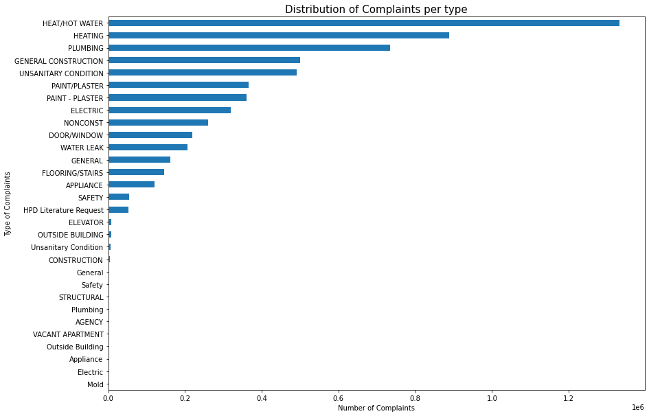

# New-York-Data-Science-Project

The goal of this project is to use data science methodologies to define and formulate a real-world business problem. 

The New York City Department of Housing Preservation and Development (HPD) needs to analyse data so that they can make data-driven decision making and decide how to approach their problems. The project is devided in 3 parts where:

1. Which type of complaint should the HPD focus on first?
2. Should the HPD focus on any particular set of boroughs, ZIP codes, or street (where the complaints are severe)?
3. Does the identified complaint types have an obvious relationship with any particular characteristic or characteristic of the houses?

## Results

1. The "Heat/Hot Water" is the one with the biggest amount of complaints. Therefore, the HPD should focus on fixing this complaint type first.

Copyright (c) IBM Corporation 2020.
